# Stope Design KPI Tracker (VBA)

VBA port of an Office Script that tracks mining **stopes** as they move through a
design workflow. It builds a KPI table from source data, then on each subsequent
run grades every stope as a **progression**, **non-progression**, or unchanged by
comparing its current design stage against the previous run's saved baseline.

## Modules

| File | Contains | Purpose |
|------|----------|---------|
| `KPI_Common.bas` | Config constants + all shared helpers | Lookup formulas, grading logic, cache read/write, summary/breakdown output |
| `KPI_Build.bas` | `BuildKPITable` macro | Creates/refreshes the KPI table from the source sheet |
| `KPI_StatusCheck.bas` | `RunStatusCheck` macro | Grades each stope vs. the saved baseline and writes results |
| `KPI_ClearSheet.bas` | `ClearSheets` macro | Resets state on a forecast change: wipes/recreates the target sheet and deletes the cache sheet |
| `KPI_SendResults.bas` | `emailResults` macro | Copies the cache + target sheets into a temp `.xlsx` and emails it via Outlook (recipient set by `RESULTS_TO` at the top of the module) |
| `KPI_QRG.bas` | `openKpiQrg` macro | Opens the KPI Quick Reference Guide (SharePoint doc) in the browser, after `URLcheck` in `KPI_Common` confirms the link responds |

## Sheets

- **`Stope Cadence`** (source) — raw stope data. Headers in row 5, data below.
- **`SchedulerData`** (target) — the run summary (`Total Stopes` / `BLACK` / `RED`
  counts + last-updated time) sits at `A1`; the `KPI` table is built lower down at
  `TABLE_ANCHOR` (`A25`) so the two never collide.
- **`_StageStateCache`** (hidden) — persistence between runs:
  - `A:C` — per-stope baseline: StopeID / DesignStage / SubProcess
  - `E` — the ordered list of stage keys (`StageOrder`)
  - `G:I` — the per-engineer Progression / Non-Progression breakdown
    (**cumulative** across every run since the last `ClearSheets`)

The cache sheet is `xlSheetHidden` (hidden, but users can unhide via right-click),
not very-hidden.

## Config (top of `KPI_Common.bas`)

| Constant | Value | Meaning |
|----------|-------|---------|
| `SRC_SHEET` | `Stope Cadence` | Source data sheet |
| `TGT_SHEET` | `SchedulerData` | KPI table + summary destination |
| `TABLE_ANCHOR` | `A25` | Top-left cell where the KPI table is created |
| `STATE_SHEET` | `_StageStateCache` | Hidden persistence sheet |
| `TBL_NAME` | `KPI` | Output ListObject name |
| `COL_ID` | 3 | Stope ID column in source |
| `COL_USER` | 8 | Assigned engineer |
| `COL_STAGE` | 22 | Design stage |
| `COL_SUB` | 23 | Sub-process |
| `COL_COMMENTS` | 24 | Comments |
| `COL_ZONE` | 35 | Zone (RED / BLACK / GREEN / YELLOW) |
| `STEPS_RED` | 1 | Stage steps required to count a RED stope as a progression |
| `STEPS_BLACK` | 2 | Stage steps required for a BLACK stope |

## How grading works

Each stope's position is a **stage key**: `CleanStr(stage) & "::" & CleanStr(sub)`
(e.g. `Draft_Design::25%`, `IFR::`). Keys are ranked by their index in the
`StageOrder` list on the cache sheet.

On a run, for each stope:

- **`new`** — the stope had no saved baseline (first time seen).
- **`?`** — the current or previous key isn't in `StageOrder` (unrecognised stage).
- **`Y`** (progression) — the stage advanced by at least the zone threshold
  (`STEPS_RED`=1 for RED, `STEPS_BLACK`=2 for BLACK).
- **`N`** (non-progression) — seen before but did not advance enough.

GREEN / YELLOW stopes are filtered out of the build and skipped during grading.
Stopes at the final **`IFR`** stage are treated the same way — hidden by the build
filter and skipped during grading (no grade, no state, no tally) — even when their
zone is RED or BLACK.

The status check re-applies the hide filter on every run, so a stope whose zone
dropped back to GREEN/YELLOW since the build (or that reached IFR) gets hidden
then too. It also checks each KPI row's ID against the source sheet: a **ghost
row** whose stope no longer exists in the source is hidden and skipped the same
way. Skipped stopes are excluded from every count — the `Total Stopes` summary
figure is the number of *graded* stopes only.

## Usage

1. Enable **Trust access to the VBA project object model** (needed only for
   re-importing modules programmatically).
2. Run **`BuildKPITable`** once to create the `KPI` table on `SchedulerData`.
3. Run **`RunStatusCheck`** to grade. The first run baselines every stope as
   `new`; each later run grades against the previous baseline and refreshes the
   summary and per-engineer breakdown.
4. When the forecast changes and you need a clean slate, run **`ClearSheets`** to
   wipe the target sheet and drop the cache, then re-run `BuildKPITable`.

Each macro ends with a `MsgBox` summary — click **OK** to finish.

## Notes / gotchas

- **Blank source cell → `""`, not `0`.** `SetLookup` wraps `INDEX` in an `IF` so a
  blank sub-process yields a key like `IFR::` instead of `IFR::0`.
- **Rebuild shows all rows first.** `ApplyLookupFormulas` calls
  `AutoFilter.ShowAllData` before writing formulas, so hidden GREEN/YELLOW rows
  don't keep stale formulas.
- **Cache baseline is stored as text.** `WriteSavedState` sets `NumberFormat = "@"`
  on `A:C` so sub-process labels like `25%` / `0%` aren't coerced into numbers
  (which previously broke the stage-key match and produced spurious `?` grades).

  # duttong18/vba-kpi architecture

> Architecture diagram of the GitHub repository duttong18/vba-kpi, generated by GitDiagram from its file tree, README and a sample of source files (last updated 2026-09-22). It is an AI-made overview: check details against the source.

- Interactive diagram: https://gitdiagram.com/duttong18/vba-kpi
- Repository: https://github.com/duttong18/vba-kpi

## Overview

This is an Excel/VBA mining workflow tracker. An engineer runs BuildKPITable to derive a filtered KPI table from Stope Cadence, then RunStatusCheck compares current stages with the hidden baseline cache, grades progression, and updates SchedulerData summaries. ClearSheets resets the forecast state, while emailResults distributes workbook results through Outlook and openKpiQrg opens the documented guide after URL validation. Relationships below are based on the README;

## Diagram (Mermaid)

```mermaid
flowchart TD

subgraph group_workflow["KPI Workflow"]
  node_source[("Stope Cadence")]
  node_build["Build KPI Table<br/>[KPI_Build.bas]"]
  node_lookup["Lookup and Filters<br/>[KPI_Common.bas]"]
  node_status["Run Status Check"]
  node_grading["Stage Grading<br/>[KPI_Common.bas]"]
end

subgraph group_state["State and Reporting"]
  node_target[("SchedulerData")]
  node_cacheio["Cache Read Write<br/>[KPI_Common.bas]"]
  node_cache[("Stage State Cache")]
  node_summary["Summary Breakdown<br/>[KPI_Common.bas]"]
end

subgraph group_operations["Operations"]
  node_clear["Clear Sheets<br/>[KPI_ClearSheet.bas]"]
end

subgraph group_integrations["External Integrations"]
  node_send["Email Results"]
  node_tempfile[("Temporary XLSX")]
  node_qrg["Open KPI Guide<br/>[KPI_QRG.bas]"]
  node_urlcheck["URL Check<br/>[KPI_Common.bas]"]
end

node_user(("Engineer"))
node_outlook["Outlook"]
node_sharepoint["SharePoint Guide"]
node_browser["Web Browser"]

node_user -->|"runs macro"| node_build
node_user -->|"runs macro"| node_status
node_user -->|"runs macro"| node_clear
node_user -->|"runs macro"| node_send
node_user -->|"runs macro"| node_qrg
node_build -->|"invokes helpers"| node_lookup
node_lookup -->|"reads data"| node_source
node_lookup -->|"writes formulas"| node_target
node_build -->|"creates table"| node_target
node_status -->|"reads KPI rows"| node_target
node_status -->|"checks IDs"| node_source
node_status -->|"reapplies filters"| node_lookup
node_status -->|"reads baseline"| node_cacheio
node_status -->|"requests grades"| node_grading
node_status -->|"saves state"| node_cacheio
node_cacheio -->|"reads and writes"| node_cache
node_status -->|"updates totals"| node_summary
node_summary -->|"writes summary"| node_target
node_clear -->|"wipes target"| node_target
node_clear -->|"deletes cache"| node_cache
node_send -->|"copies cache"| node_cache
node_send -->|"copies results"| node_target
node_send -->|"creates workbook"| node_tempfile
node_send -.->|"sends email"| node_outlook
node_tempfile -.->|"attaches workbook"| node_outlook
node_qrg -.->|"validates link"| node_urlcheck
node_urlcheck -.->|"checks response"| node_sharepoint
node_qrg -.->|"opens guide"| node_browser
node_browser -.->|"loads document"| node_sharepoint

click node_build "https://github.com/duttong18/vba-kpi/blob/main/KPI_Build.bas"
click node_lookup "https://github.com/duttong18/vba-kpi/blob/main/KPI_Common.bas"
click node_status "https://github.com/duttong18/vba-kpi/blob/main/KPI_StatusCheck.bas"
click node_grading "https://github.com/duttong18/vba-kpi/blob/main/KPI_Common.bas"
click node_cacheio "https://github.com/duttong18/vba-kpi/blob/main/KPI_Common.bas"
click node_summary "https://github.com/duttong18/vba-kpi/blob/main/KPI_Common.bas"
click node_clear "https://github.com/duttong18/vba-kpi/blob/main/KPI_ClearSheet.bas"
click node_send "https://github.com/duttong18/vba-kpi/blob/main/KPI_SendResults.bas"
click node_qrg "https://github.com/duttong18/vba-kpi/blob/main/KPI_QRG.bas"
click node_urlcheck "https://github.com/duttong18/vba-kpi/blob/main/KPI_Common.bas"

classDef toneNeutral fill:#f8fafc,stroke:#334155,stroke-width:1.5px,color:#0f172a
classDef toneBlue fill:#dbeafe,stroke:#2563eb,stroke-width:1.5px,color:#172554
classDef toneAmber fill:#fef3c7,stroke:#d97706,stroke-width:1.5px,color:#78350f
classDef toneMint fill:#dcfce7,stroke:#16a34a,stroke-width:1.5px,color:#14532d
classDef toneRose fill:#ffe4e6,stroke:#e11d48,stroke-width:1.5px,color:#881337
classDef toneIndigo fill:#e0e7ff,stroke:#4f46e5,stroke-width:1.5px,color:#312e81
classDef toneTeal fill:#ccfbf1,stroke:#0f766e,stroke-width:1.5px,color:#134e4a
class node_source,node_build,node_lookup,node_status,node_grading,node_browser toneBlue
class node_target,node_cacheio,node_cache,node_summary toneAmber
class node_clear toneMint
class node_send,node_tempfile,node_qrg,node_urlcheck toneRose
class node_user,node_outlook,node_sharepoint toneIndigo
```

## Components

### KPI Workflow

- **Stope Cadence**
- [Build KPI Table](https://github.com/duttong18/vba-kpi/blob/main/KPI_Build.bas): `KPI_Build.bas`
- [Lookup and Filters](https://github.com/duttong18/vba-kpi/blob/main/KPI_Common.bas): `KPI_Common.bas`
- [Run Status Check](https://github.com/duttong18/vba-kpi/blob/main/KPI_StatusCheck.bas): `KPI_StatusCheck.bas`
- [Stage Grading](https://github.com/duttong18/vba-kpi/blob/main/KPI_Common.bas): `KPI_Common.bas`

### State and Reporting

- **SchedulerData**
- [Cache Read Write](https://github.com/duttong18/vba-kpi/blob/main/KPI_Common.bas): `KPI_Common.bas`
- **Stage State Cache**
- [Summary Breakdown](https://github.com/duttong18/vba-kpi/blob/main/KPI_Common.bas): `KPI_Common.bas`

### Operations

- [Clear Sheets](https://github.com/duttong18/vba-kpi/blob/main/KPI_ClearSheet.bas): `KPI_ClearSheet.bas`

### External Integrations

- [Email Results](https://github.com/duttong18/vba-kpi/blob/main/KPI_SendResults.bas): `KPI_SendResults.bas`
- **Temporary XLSX**
- [Open KPI Guide](https://github.com/duttong18/vba-kpi/blob/main/KPI_QRG.bas): `KPI_QRG.bas`
- [URL Check](https://github.com/duttong18/vba-kpi/blob/main/KPI_Common.bas): `KPI_Common.bas`

### Other components

- **Engineer**
- **Outlook**
- **SharePoint Guide**
- **Web Browser**

## Connections

- Engineer → Build KPI Table: runs macro
- Engineer → Run Status Check: runs macro
- Engineer → Clear Sheets: runs macro
- Engineer → Email Results: runs macro
- Engineer → Open KPI Guide: runs macro
- Build KPI Table → Lookup and Filters: invokes helpers
- Lookup and Filters → Stope Cadence: reads data
- Lookup and Filters → SchedulerData: writes formulas
- Build KPI Table → SchedulerData: creates table
- Run Status Check → SchedulerData: reads KPI rows
- Run Status Check → Stope Cadence: checks IDs
- Run Status Check → Lookup and Filters: reapplies filters
- Run Status Check → Cache Read Write: reads baseline
- Run Status Check → Stage Grading: requests grades
- Run Status Check → Cache Read Write: saves state
- Cache Read Write → Stage State Cache: reads and writes
- Run Status Check → Summary Breakdown: updates totals
- Summary Breakdown → SchedulerData: writes summary
- Clear Sheets → SchedulerData: wipes target
- Clear Sheets → Stage State Cache: deletes cache
- Email Results → Stage State Cache: copies cache
- Email Results → SchedulerData: copies results
- Email Results → Temporary XLSX: creates workbook
- Email Results → Outlook: sends email
- Temporary XLSX → Outlook: attaches workbook
- Open KPI Guide → URL Check: validates link
- URL Check → SharePoint Guide: checks response
- Open KPI Guide → Web Browser: opens guide
- Web Browser → SharePoint Guide: loads document
